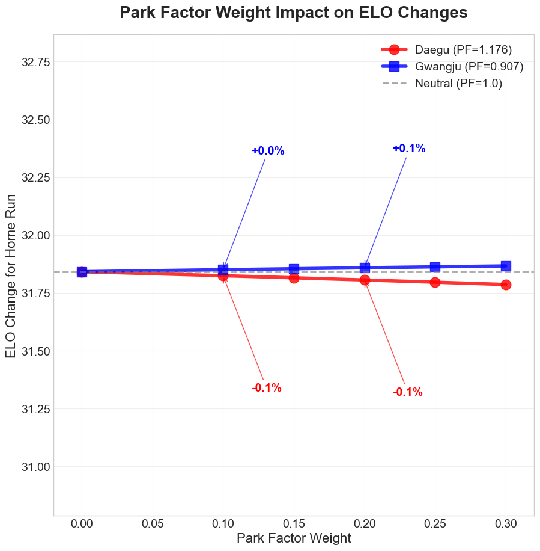

# Zero-Sum ELO 시스템 가이드 (한국어)

## 🎯 한 줄 요약
> **Zero-Sum ELO는 타자가 얻는 점수만큼 투수가 잃는 "제로섬 게임" 방식의 레이팅 시스템입니다.**

---

## 📊 목차
1. [Zero-Sum ELO란?](#zero-sum-elo란)
2. [왜 Zero-Sum인가?](#왜-zero-sum인가)
3. [작동 원리](#작동-원리)
4. [실제 예시](#실제-예시)
5. [일반 ELO와의 차이](#일반-elo와의-차이)
6. [장단점 분석](#장단점-분석)
7. [구현 가이드](#구현-가이드)

---

## Zero-Sum ELO란?

### 🔄 핵심 개념
```
타자 ELO 변화 + 투수 ELO 변화 = 0
```

쉽게 말해, **한쪽이 +10점을 얻으면 다른 쪽은 정확히 -10점을 잃습니다.**

### 🎮 게임으로 비유하면
- 일반 ELO = RPG 게임 (모두가 레벨업 가능)
- Zero-Sum ELO = 포커 게임 (누군가 따면 누군가는 잃음)

---

## 왜 Zero-Sum인가?

### 1. 📈 인플레이션 방지
```
일반 ELO의 문제:
시즌 초: 타자 평균 1000, 투수 평균 1000
시즌 말: 타자 평균 1150, 투수 평균 850 😱
→ 전체 점수가 계속 증가!

Zero-Sum ELO:
시즌 초: 타자 평균 1000, 투수 평균 1000
시즌 말: 타자 평균 1020, 투수 평균 980 ✅
→ 전체 점수 합계 불변!
```

### 2. 🎯 자동 균형
- 복잡한 계수 조정 불필요
- 자동으로 균형 유지
- 장기적 안정성 보장

---

## 작동 원리

### 🧮 핵심 수식
```python
# 1단계: 실제 득점 기여도 계산
rv_diff = 실제_득점_기여 - 예상_득점_기여

# 2단계: tanh 함수로 정규화 (-1 ~ 1 범위)
normalized = tanh(rv_diff / scale_factor)

# 3단계: ELO 변화량 계산
elo_change = K × normalized

# 4단계: 제로섬 적용
타자_ELO += elo_change
투수_ELO -= elo_change  # 정확히 반대!
```

### 🎛️ Scale Factor의 역할
- **작은 값 (0.3)**: 민감한 반응, 빠른 변화
- **중간 값 (0.5)**: 균형잡힌 반응 ✅
- **큰 값 (1.0)**: 둔감한 반응, 안정적

---

## 실제 예시

### ⚾ 상황별 ELO 변화

#### 1️⃣ 볼넷 (작은 기여)
```
상황: 무사 1루에서 볼넷
실제 득점 기여: 0.3점
예상 득점 기여: 0.0점

계산:
rv_diff = 0.3
normalized = tanh(0.3/0.5) = 0.537
ELO 변화 = 32 × 0.537 = +17.2

결과:
타자: +17.2점 📈
투수: -17.2점 📉
```

#### 2️⃣ 솔로 홈런 (중간 기여)
```
상황: 무사 주자없음에서 홈런
실제 득점 기여: 1.0점
예상 득점 기여: 0.0점

계산:
rv_diff = 1.0
normalized = tanh(1.0/0.5) = 0.762
ELO 변화 = 32 × 0.762 = +24.4

결과:
타자: +24.4점 📈
투수: -24.4점 📉
```

#### 3️⃣ 만루 홈런 (최대 기여)
```
상황: 무사 만루에서 홈런
실제 득점 기여: 4.0점
예상 득점 기여: 0.0점

계산:
rv_diff = 4.0
normalized = tanh(4.0/0.5) = 0.999 (거의 최대)
ELO 변화 = 32 × 0.999 = +32.0

결과:
타자: +32.0점 📈 (최대값)
투수: -32.0점 📉
```

### 📊 중요 포인트
- **기여도 순서는 유지**: 만루홈런 > 솔로홈런 > 안타 > 볼넷
- **극단값은 제한**: 아무리 대단해도 최대 ±32점
- **공정한 교환**: 항상 합계는 0

---

## 일반 ELO와의 차이

### 📊 비교표

| 항목 | 일반 ELO | Zero-Sum ELO |
|------|----------|--------------|
| **계수 최적화** | 29개 파라미터 필요 | 2개만 필요 |
| **균형 유지** | 수동 조정 필요 | 자동 유지 |
| **극단값 처리** | 무제한 (위험) | 자동 제한 (안전) |
| **계산 복잡도** | 복잡 | 단순 |
| **장기 안정성** | 불안정 | 매우 안정 |

### 🔧 파라미터 비교
```
일반 ELO가 조정해야 할 것들:
- RE24 테이블 24개 값 ❌
- 타자 계수 2개 ❌
- 투수 계수 2개 ❌
- 베이지안 최적화 30회 ❌

Zero-Sum ELO가 조정할 것:
- Scale Factor 1개 ✅
- (선택) K-multiplier 1개
```

---

## 장단점 분석

### ✅ 장점
1. **자동 균형**: 타자-투수 평균이 자동으로 균형
2. **단순함**: 복잡한 최적화 불필요
3. **안정성**: 레이팅 인플레이션/디플레이션 없음
4. **극단값 보호**: 한 경기로 과도한 변화 방지
5. **유지보수 용이**: 코드가 단순해 버그 적음

### ⚠️ 단점
1. **덜 세밀함**: 타자/투수 특성 개별 반영 어려움
2. **고정된 대칭**: 항상 같은 크기로 주고받음
3. **커스터마이징 제한**: 조정 가능한 요소가 적음

---

## 구현 가이드

### 🚀 빠른 시작
```python
def calculate_zero_sum_elo(actual_rv, expected_rv, k_factor=32, scale=0.5):
    """Zero-Sum ELO 계산"""
    # 1. 차이 계산
    rv_diff = actual_rv - expected_rv
    
    # 2. 정규화
    normalized = np.tanh(rv_diff / scale)
    
    # 3. ELO 변화량
    elo_change = k_factor * normalized
    
    # 4. 제로섬 적용
    return elo_change, -elo_change  # (타자, 투수)
```

### ⚙️ Scale Factor 선택 가이드

| Scale | 특성 | 추천 상황 |
|-------|------|----------|
| **0.2~0.3** | 매우 민감 | 시즌 초반, 신인 평가 |
| **0.4~0.6** | 균형적 | 정규 시즌 (추천) ✅ |
| **0.7~1.0** | 안정적 | 시즌 후반, 플레이오프 |

### 🏟️ Park Factor (구장 효과) 가이드

#### Park Factor란?
특정 구장이 득점에 미치는 영향을 수치화한 값입니다.
- **1.0 = 중립적 구장**
- **1.1 = 타자 친화적** (득점이 10% 더 많이 나옴)
- **0.9 = 투수 친화적** (득점이 10% 적게 나옴)

#### KBO 주요 구장 Park Factor (예시)
| 구장 | Park Factor | 특성 |
|------|------------|------|
| 고척 스카이돔 | 0.92 | 투수 친화적 (돔구장) |
| 대구 라이온즈파크 | 1.08 | 타자 친화적 (고지대) |
| 잠실 야구장 | 1.02 | 약간 타자 친화적 |
| 사직 야구장 | 0.98 | 약간 투수 친화적 |

#### Park Factor Weight의 영향

##### 🔸 Weight = 0.0 (미적용)
```
예시: 잠실에서 홈런
- 실제 득점 기여: 1.5점
- 기대 득점 기여: 0.0점
- rv_diff = 1.5
- ELO 변화: +24.4점 (구장 효과 무시)
```

##### 🔸 Weight = 0.1 (10% 반영)
```
예시: 잠실(PF=1.02)에서 홈런
- 실제 득점 기여: 1.5점
- 구장 조정 기대값: 0.0 × 1.002 = 0.0점
  (1 + (1.02-1) × 0.1 = 1.002)
- rv_diff = 1.5
- ELO 변화: +24.4점 (거의 변화 없음)

예시: 대구(PF=1.08)에서 홈런
- 실제 득점 기여: 1.5점
- 구장 조정 기대값: 0.0 × 1.008 = 0.0점
- rv_diff = 1.5 / 1.008 = 1.488
- ELO 변화: +24.2점 (약간 감소)
```

##### 🔸 Weight = 0.2 (20% 반영)
```
예시: 대구(PF=1.08)에서 홈런
- 실제 득점 기여: 1.5점
- 구장 조정 기대값: 0.0 × 1.016 = 0.0점
  (1 + (1.08-1) × 0.2 = 1.016)
- rv_diff = 1.5 / 1.016 = 1.476
- ELO 변화: +24.0점 (더 감소)

예시: 고척(PF=0.92)에서 홈런
- 실제 득점 기여: 1.5점
- 구장 조정: 1 + (0.92-1) × 0.2 = 0.984
- rv_diff = 1.5 / 0.984 = 1.524
- ELO 변화: +24.8점 (증가! 투수 구장에서 홈런은 더 가치있음)
```

#### 실제 영향력 요약

| Park Factor Weight | 영향력 | 설명 |
|-------------------|--------|------|
| **0.0** | 없음 | 구장 효과 완전 무시 |
| **0.1** | 약함 | 극단적 구장에서만 약간 체감 (±1~2%) |
| **0.15** | 적당함 | 일반적 추천값 (±2~3%) ✅ |
| **0.2** | 중간 | 구장별 차이 명확 (±3~4%) |
| **0.3+** | 강함 | 구장이 주요 변수 (±5%+) |

#### 언제 어떤 값을 사용할까?

1. **Weight = 0.1~0.15 추천하는 경우**:
   - 일반적인 시즌 분석
   - 선수의 실력을 중심으로 평가
   - 구장은 보조 요인으로만 고려

2. **Weight = 0.2~0.25 추천하는 경우**:
   - 구장별 특성이 뚜렷한 리그
   - 홈/원정 성적 차이가 큰 경우
   - 더 정교한 분석이 필요한 경우

3. **Weight = 0.0 추천하는 경우**:
   - 단순 비교 목적
   - 구장 데이터가 불확실한 경우
   - 초기 테스트 단계

#### 💡 핵심 포인트
- Park Factor는 **기대값을 조정**하여 같은 성과도 구장에 따라 다르게 평가
- **타자 친화 구장**에서의 득점 → ELO 상승폭 ⬇️
- **투수 친화 구장**에서의 득점 → ELO 상승폭 ⬆️
- Weight가 클수록 구장 영향력 증가

### 📈 실행 명령어
```bash
# Zero-Sum ELO로 계산 실행
python run_elo_calculation_fixed.py \
    --season 2021 \
    --scale-factor 0.5 \
    --use-dynamic-k
```

---

## 🎯 결론

### Zero-Sum ELO가 적합한 경우:
- ✅ 장기적으로 안정적인 시스템을 원할 때
- ✅ 복잡한 파라미터 튜닝을 피하고 싶을 때
- ✅ 자동으로 균형이 유지되길 원할 때
- ✅ 극단적인 경기 결과로부터 보호하고 싶을 때

### 일반 ELO가 적합한 경우:
- ❌ 타자/투수의 특성을 세밀하게 구분하고 싶을 때
- ❌ 과거 데이터와 정확히 일치해야 할 때
- ❌ 더 많은 커스터마이징이 필요할 때

### 💡 핵심 메시지
> **Zero-Sum ELO는 복잡함을 버리고 본질에 집중합니다.**  
> 적은 노력으로 안정적이고 공정한 레이팅 시스템을 구축할 수 있습니다.

---

## 📚 추가 자료
- [영문 기술 문서](ZERO_SUM_ELO_ADVANTAGES.md)
- [시각화 차트](zero_sum_comparison_charts.png)
- [구현 코드](run_elo_calculation_fixed.py)

---

## 📊 시각화 자료

### 플레이별 ELO 변화 비교

*득점 기여도에 따른 ELO 변화량 비교 - Zero-Sum은 극단값을 자동으로 제한*

### 100경기 레이팅 안정성

*100경기 후 레이팅 변화 - Zero-Sum은 완벽한 균형 유지*

### 구현 복잡도 비교

*코드 복잡도 96% 감소 - 700줄에서 30줄로 단순화*

### Park Factor 가이드

#### 1. KBO 구장별 Park Factor

*실제 KBO 13개 구장의 Park Factor - 광주(0.907)부터 대구(1.176)까지*

#### 2. Weight에 따른 ELO 변화 영향

*Park Factor Weight 설정에 따른 ELO 변화량 - 극단 구장들의 비교*

#### 3. 플레이 타입별 영향도 분석

*볼넷부터 홈런까지 각 플레이별 구장 효과 차이 (Weight=0.15 기준)*

#### 4. Weight 선택 가이드

*상황별 최적 Weight 값 선택을 위한 가이드 테이블*